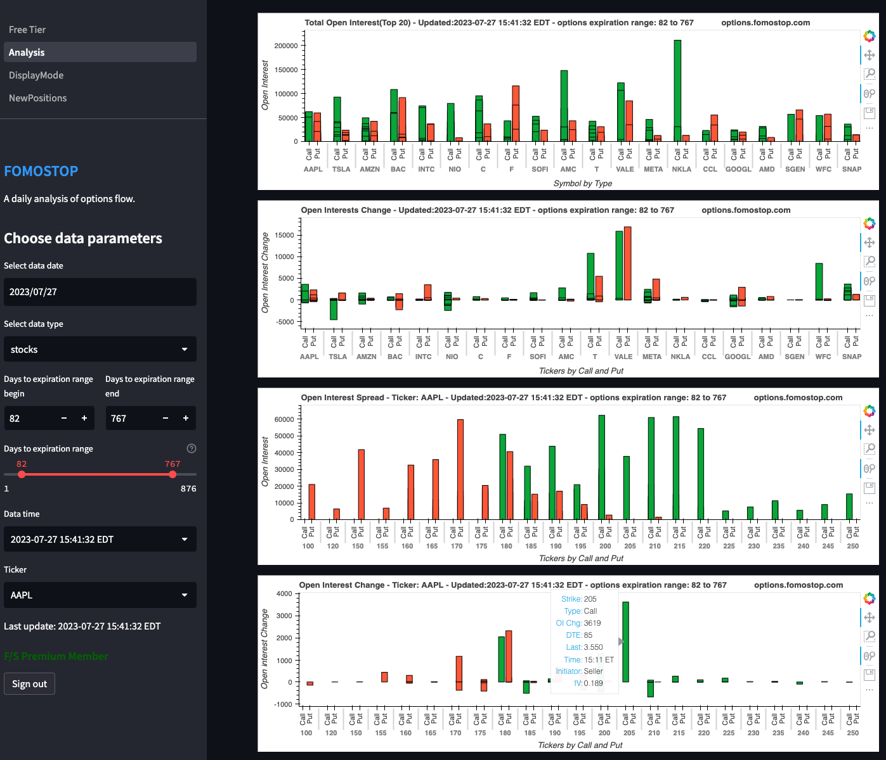
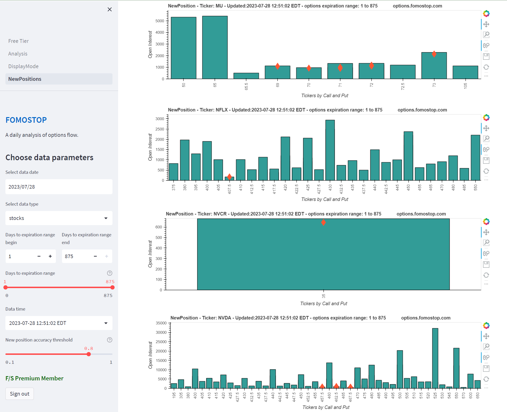
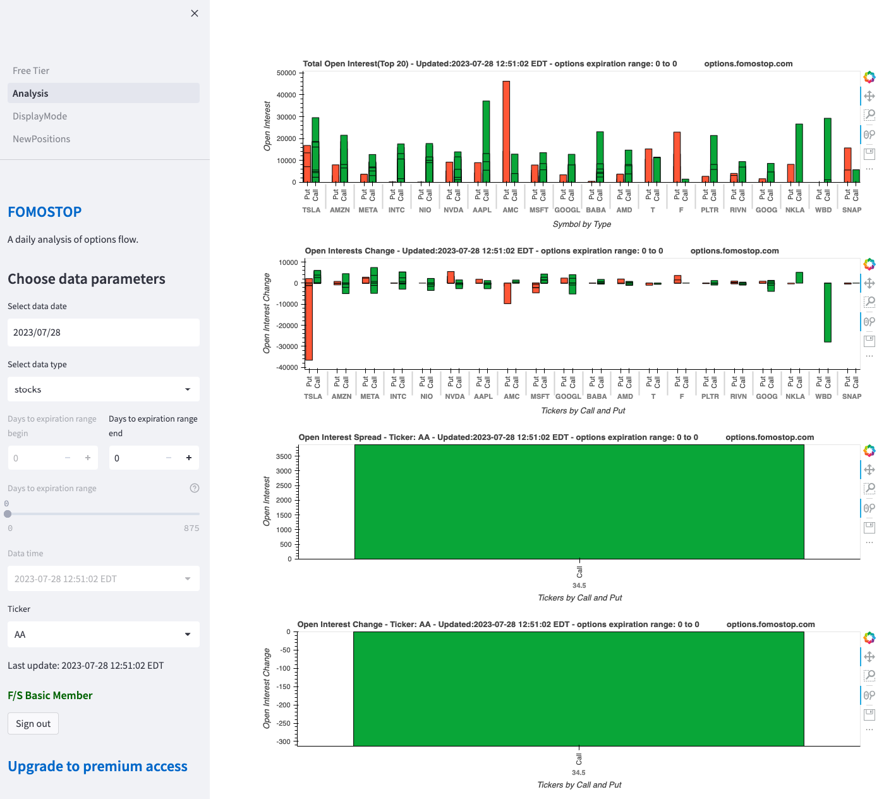
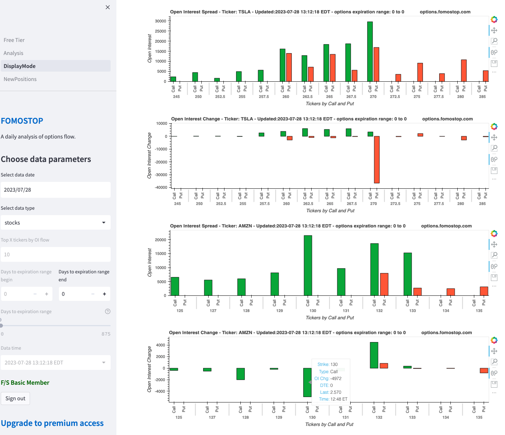
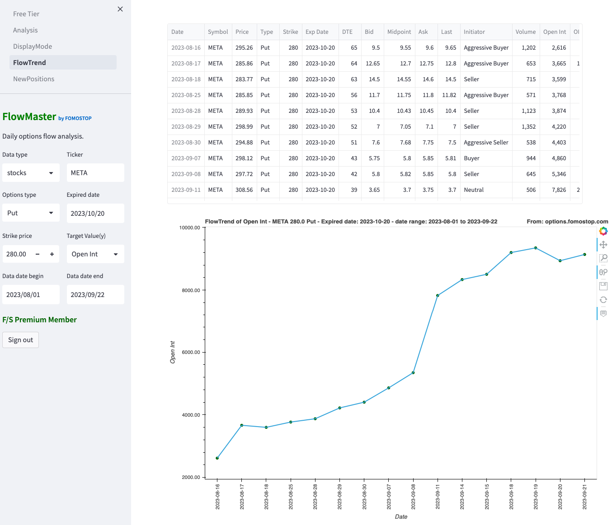

# Options Flow Analytics Platform

[](https://www.python.org/)
[](https://streamlit.io/)
[](https://www.postgresql.org/)
[](https://www.docker.com/)

> **Production-grade financial data platform** for analyzing daily options market activity. Built and maintained since 2021, processing **1M+ options records** across 3 years of operation.

---

## 📸 Screenshots

### Main Dashboard - Options Flow Analysis

*Real-time visualization of open interest changes across stocks and ETFs*

### Historical Trend Analysis

*Time-series tracking of options flow patterns*

### Data Table View

*Detailed options data with filtering and sorting capabilities*

### Flow Trend Visualization

*Interactive charts showing market sentiment and unusual activity*

### Advanced Analytics

*Premium tier features with multi-dimensional analysis*

---

## 📊 Project Overview

FOMO Options is an end-to-end automated data platform that collects, processes, and visualizes options flow data to help traders identify unusual market activity and sentiment shifts.

### Key Metrics
- **📈 Data Volume**: 1M+ records collected over 3 years
- **🔄 Daily Processing**: ~1,300 options records per trading day
- **👥 User Base**: 100+ registered users
- **⏱️ Uptime**: 3+ years of continuous operation
- **💻 Codebase**: 3,864 lines of Python across 41 modules

### Core Features
- ✅ **Automated ETL Pipeline**: Daily data collection, cleaning, and storage
- ✅ **Real-time Analytics**: Interactive dashboards with filtering and visualization
- ✅ **User Authentication**: Role-based access control (Free/Premium tiers)
- ✅ **Sentiment Analysis**: Automated detection of aggressive buying/selling
- ✅ **Historical Analysis**: Time-series tracking of open interest changes
- ✅ **Dockerized Deployment**: Containerized microservices architecture

---

## 🛠️ Technology Stack

**Backend & Data Processing**
- **Python 3.9+**: Core application logic
- **Selenium WebDriver**: Automated data collection
- **Pandas**: Data cleaning and transformation
- **PostgreSQL**: Time-series data storage
- **psycopg2**: Database connectivity

**Frontend & Visualization**
- **Streamlit**: Interactive web application framework
- **HoloViews + Bokeh**: Advanced data visualization
- **hvPlot**: High-level plotting interface

**Infrastructure**
- **Docker**: Containerization for both services
- **Oracle Cloud Infrastructure**: Production hosting
- **Selenium Grid**: Distributed browser automation

---

## 📁 Project Structure

```
fomooptions/
│
├── OpUpdate/                    # ETL Pipeline Service
│   ├── Modules/
│   │   ├── DataAutoDownload.py  # Selenium-based web scraper
│   │   ├── CleanData.py         # Data cleaning & feature engineering
│   │   └── DataBaseFlow.py      # PostgreSQL read/write operations
│   ├── Data/                    # Raw CSV storage
│   │   ├── Increase/            # Open interest increases
│   │   └── Decrease/            # Open interest decreases
│   ├── Dockerfile               # Container configuration
│   └── requirements.txt
│
├── OpWeb/                       # Web Application Service
│   ├── Modules/
│   │   ├── AnalyzeFree.py       # Free tier analytics
│   │   ├── AnalyzePremium.py    # Premium tier analytics
│   │   ├── AuthorControl.py     # User authentication
│   │   ├── DataBaseAuth.py      # Auth database operations
│   │   └── DataBaseFlow.py      # Data retrieval logic
│   ├── pages/                   # Multi-page Streamlit app
│   │   ├── Analysis.py          # Main analysis dashboard
│   │   ├── DisplayMode.py       # Data table view
│   │   ├── FlowTrend.py         # Historical trend analysis
│   │   └── NewPositions.py      # New position tracking
│   ├── Free_Tier.py             # Main application entry
│   ├── Dockerfile
│   └── requirements.txt
│
└── requirements.txt             # Global dependencies
```

---

## 🚀 Key Features Breakdown

### 1. Automated Data Collection (`OpUpdate`)

**Selenium-based Web Scraper**
- Automated login and session management
- Robust error handling with multiple selector fallbacks
- Scheduled daily execution during market hours
- Handles 4 data sources (stocks/ETFs × increase/decrease)

**Data Processing Pipeline**
```python
# Example workflow
1. Selenium downloads CSV files → Data/Increase & Data/Decrease
2. CleanData.py processes raw data:
   - Removes commas, handles missing values
   - Converts data types (Strike, OI Change → float)
   - Calculates DTE (Days to Expiration)
   - Merges increase/decrease datasets
3. DataBaseFlow.py writes to PostgreSQL:
   - Adds sentiment analysis (Aggressive Buyer/Seller)
   - Stores with timestamp for historical tracking
```

### 2. Interactive Web Dashboard (`OpWeb`)

**Multi-tier Analytics**
- **Free Tier**: Basic open interest change visualization
- **Premium Tier**: Advanced filtering, historical trends, new position alerts

**Key Visualizations**
- 📊 Open Interest Change by Ticker (Bar charts)
- 📈 Historical Flow Trends (Time-series)
- 🎯 Unusual Activity Detection (Volume/OI ratio)
- 🔍 Sentiment Analysis (Call/Put distribution)

**User Features**
- Date range selection
- DTE filtering (Days to Expiration)
- Stock/ETF toggle
- Real-time data updates

### 3. Database Design

**PostgreSQL Schema**
```sql
-- Optimized for time-series queries
CREATE TABLE options_flow (
    symbol VARCHAR(10),
    price DECIMAL,
    exp_date DATE,
    dte INTEGER,
    type VARCHAR(4),  -- Call/Put
    strike DECIMAL,
    volume INTEGER,
    open_interest INTEGER,
    oi_change INTEGER,
    sentiment VARCHAR(20),  -- Aggressive Buyer/Seller
    timestamp INTEGER,
    -- Indexes for fast queries
    INDEX idx_symbol_date (symbol, timestamp),
    INDEX idx_dte (dte)
);
```

---

## 🛠️ Technical Highlights

### Data Engineering
- **ETL Automation**: Fully automated daily pipeline with error recovery
- **Data Quality**: Robust cleaning handles missing values, type conversions, outliers
- **Feature Engineering**: Calculated fields (DTE, sentiment, Vol/OI ratio)
- **Scalability**: Processed 1M+ records over 3 years without performance degradation

### Software Engineering
- **Modular Design**: Separation of concerns (data collection, processing, visualization)
- **Error Handling**: Comprehensive try-catch blocks with logging
- **Configuration Management**: Environment variables for credentials
- **Containerization**: Docker for consistent deployment

### Web Development
- **Session Management**: Streamlit session state for user interactions
- **Responsive UI**: Dynamic filtering and real-time updates
- **Authentication**: Cookie-based user authentication with role-based access

---

## 📦 Installation & Setup

### Prerequisites
- Python 3.9+
- PostgreSQL 15+
- Docker (optional, for containerized deployment)
- Chrome/Chromium (for Selenium)

### Local Development

1. **Clone the repository**
```bash
git clone <repository-url>
cd fomooptions
```

2. **Install dependencies**
```bash
pip install -r requirements.txt
```

3. **Configure environment variables**
```bash
# Create .env file
cp .env.example .env

# Edit with your credentials
# Required variables:
# - username: Data source login
# - password: Data source password
# - Flow_SQL_DB: PostgreSQL database name
# - Flow_SQL_USER: PostgreSQL username
# - Flow_SQL_PASSWORD: PostgreSQL password
# - Flow_SQL_HOST: PostgreSQL host
```

4. **Initialize database**
```sql
-- Create database and tables
CREATE DATABASE your_database_name;

-- Run schema creation (see ARCHITECTURE section for schema)
```

5. **Run data collection**
```bash
cd OpUpdate/Modules
python DataAutoDownload.py
```

6. **Launch web application**
```bash
cd OpWeb
streamlit run Free_Tier.py
```

### Docker Deployment

```bash
# Build and run OpUpdate service
cd OpUpdate
docker build -t options-update .
docker run -d --env-file .env options-update

# Build and run OpWeb service
cd OpWeb
docker build -t options-web .
docker run -d -p 8501:8501 --env-file .env options-web
```

---

## 📈 Sample Data Output

**Daily Options Flow (2025-09-29)**
| Symbol | Price | Exp Date | DTE | Type | Strike | OI Change | Vol/OI | Sentiment |
|--------|-------|----------|-----|------|--------|-----------|--------|-----------|
| NVDA   | 181.55| 2025-10-03| 4  | Call | 182.50 | +48,368   | 1.37   | Aggressive Buyer |
| INTC   | 34.63 | 2025-10-17| 18 | Call | 40.00  | +64,281   | 0.67   | Buyer |
| OPEN   | 8.22  | 2025-10-03| 4  | Put  | 8.00   | +61,228   | 0.29   | Seller |

---

## 🎯 Use Cases

1. **Day Traders**: Identify unusual options activity for potential momentum plays
2. **Swing Traders**: Track multi-day open interest trends for directional bias
3. **Risk Managers**: Monitor large position changes for hedging opportunities
4. **Researchers**: Analyze historical options flow patterns

---

## 🏗️ System Architecture

### High-Level Overview

```
┌─────────────────────────────────────────────────────────────┐
│                   Options Flow Platform                      │
└─────────────────────────────────────────────────────────────┘
                              │
        ┌─────────────────────┼─────────────────────┐
        │                     │                     │
   ┌────▼────┐          ┌────▼────┐          ┌────▼────┐
   │ OpUpdate│          │  OpWeb  │          │Database │
   │ Service │          │ Service │          │PostgreSQL│
   └────┬────┘          └────┬────┘          └────┬────┘
        │                     │                     │
   ┌────▼────────┐      ┌────▼─────────┐     ┌────▼────┐
   │  Selenium   │      │  Streamlit   │     │ Time-   │
   │ Web Scraper │      │  Dashboard   │     │ Series  │
   └─────────────┘      └──────────────┘     │  Data   │
                                              └─────────┘
```

### Data Pipeline Workflow

**1. Data Collection (OpUpdate Service)**
```
Selenium WebDriver → Login & Navigate → Download CSV Files
                                              ↓
                                    Raw Data (4 sources)
                                              ↓
                                    Pandas Processing
                                    - Remove formatting
                                    - Handle missing values
                                    - Type conversion
                                    - Calculate DTE
                                    - Merge datasets
                                              ↓
                                    Feature Engineering
                                    - Sentiment analysis
                                    - Vol/OI ratio
                                    - Moneyness
                                              ↓
                                    PostgreSQL Write
                                    - Bulk insert
                                    - Timestamp indexing
```

**2. Web Application (OpWeb Service)**
```
User Request → Authentication → Session Management
                                        ↓
                              User Input (Filters)
                              - Date selection
                              - DTE range
                              - Stock/ETF toggle
                                        ↓
                              Database Query
                              - Filtered retrieval
                              - Sorting by OI change
                                        ↓
                              Data Visualization
                              - Interactive charts
                              - Tables
                              - Trend analysis
```

### Database Schema

```sql
-- Optimized for time-series queries
CREATE TABLE options_flow_stocks (
    symbol VARCHAR(10),
    price DECIMAL(10,2),
    exp_date DATE,
    dte INTEGER,
    type VARCHAR(4),  -- Call/Put
    strike DECIMAL(10,2),
    volume INTEGER,
    open_interest INTEGER,
    oi_change INTEGER,
    sentiment VARCHAR(20),  -- Aggressive Buyer/Seller
    timestamp INTEGER,
    PRIMARY KEY (symbol, exp_date, type, strike, timestamp)
);

-- Performance indexes
CREATE INDEX idx_timestamp ON options_flow_stocks(timestamp);
CREATE INDEX idx_symbol_date ON options_flow_stocks(symbol, timestamp);
CREATE INDEX idx_dte ON options_flow_stocks(dte);
CREATE INDEX idx_oi_change ON options_flow_stocks(oi_change DESC);
```

---

## 🔮 Future Enhancements

- [ ] **Machine Learning**: Predict unusual activity using LSTM/Transformer models
- [ ] **Real-time Alerts**: Push notifications for significant OI changes
- [ ] **API Development**: RESTful API for programmatic access
- [ ] **Advanced Analytics**: Greeks calculation, implied volatility analysis
- [ ] **Performance Optimization**: Implement caching layer with Redis

---

## 📝 License

This project is proprietary software. All rights reserved.

---

## 🙏 Acknowledgments

- Built with [Streamlit](https://streamlit.io/) for rapid web development
- Data visualization powered by [HoloViews](https://holoviews.org/) and [Bokeh](https://bokeh.org/)
- Web automation with [Selenium](https://www.selenium.dev/)
- Database: [PostgreSQL](https://www.postgresql.org/)

---

**⭐ If you find this project interesting, please consider starring the repository!**

